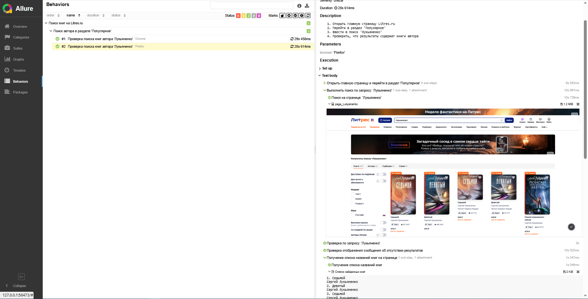
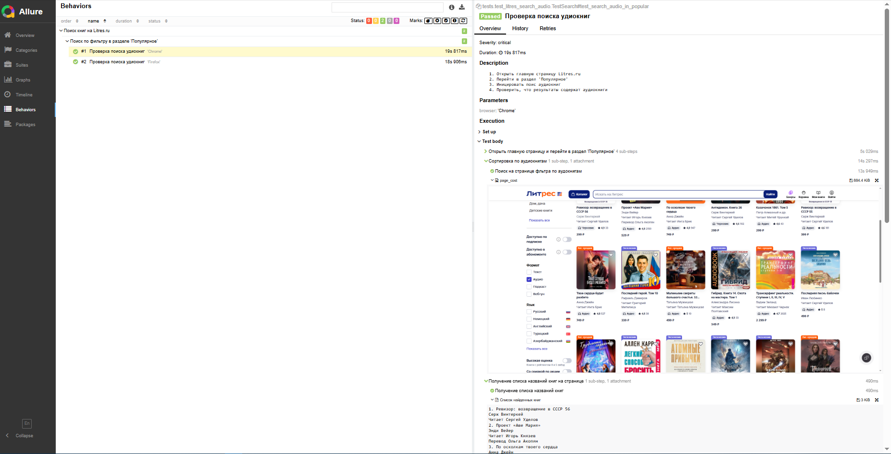
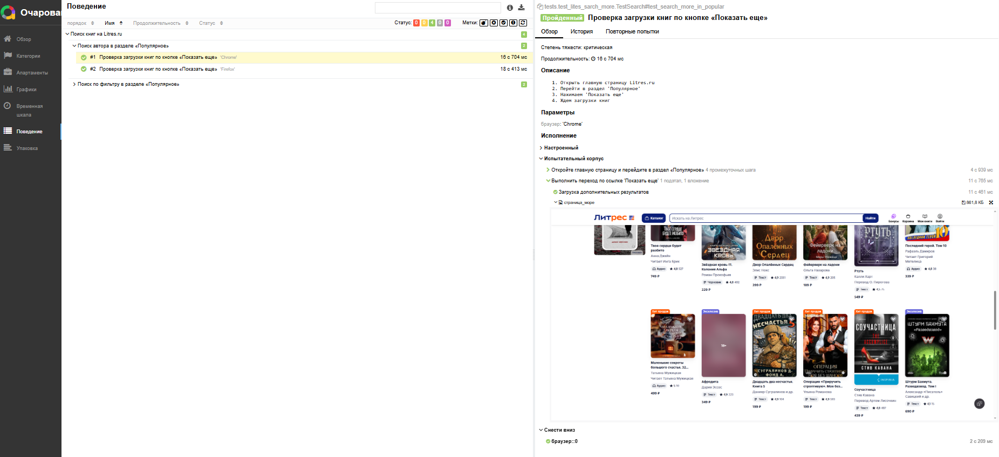
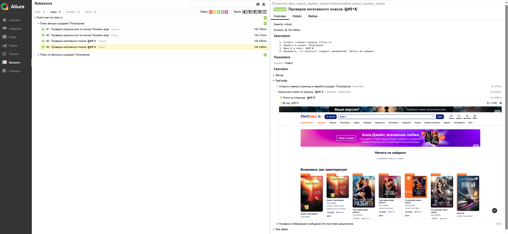
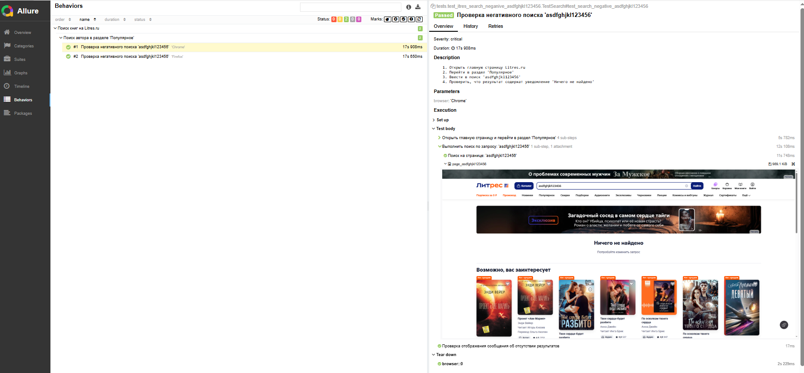

# Общая информация

Разработано 5  автотестов с использованием:
- Python 3.8+ — язык программирования
- Selenium WebDriver — фреймворк для автоматизации браузера
- PyTest — тестовый фреймворк
- Page Object Model — паттерн проектирования

# Структура проекта 
____________________
````
Litres-testing/
│
├── venv/
│    
├── allure_result/
|
├── MindMap/
│   └── MindMap_Litres.jpg
│
├── test-plan/
│   └── TestPlan_Litres.pdf
│
├── checklist/
│   └── ChecList_Litres.pdf
│
├── test-cases/
│   └── TestCases_Litres.pdf 
│
├── skrin/
│   
├── pages/
│   ├── __init__.py
│   ├── base_page.py
│   ├── main_page.py
│   └── search_page.py
│
├── tests/
│   ├── __init__.py
│   ├── test_litres_search_Lukyanenko.py 
│   ├── test_litres_search_more.py    
│   ├── test_litres_search_audio.py    
│   ├── test_litres_search_negative_symbol.py 
│   └── test_litres_search_negative_asdfghjkl123456.py        
│
├── README.md (Инструкция по запуску автотестов)
│
├── pytest.ini
│
└── conftest.py
````

# Автотесты

## Список автотестов
````
______________________________________________________________________________________________
| № |            Файл              |       Название теста            |    Описание           |
|___|______________________________|_________________________________|_______________________|
| 1 |test_litres_search_Lukyanenko |test_search_lukyanenko_in_popular|Тест предназначен для  |
|   |                              |                                 |получения списка книг  |
|   |                              |                                 |автора Лукьяненко в    |
|   |                              |                                 |разделе Популярное на  |
|   |                              |                                 |Litres                 |
|___|______________________________|_________________________________|_______________________|
| 2 |test_litres_search_audio      |test_search_audio_in_popular     |Позитивный тест        |
|   |                              |                                 |предназначен для       |
|   |                              |                                 |получения списка       |
|   |                              |                                 |аудиокниг в разделе    | 
|   |                              |                                 |Популярное на Litres   |
|___|______________________________|_________________________________|_______________________|
| 3 |test_lites_sarch_more         |test_search_more_in_popular      |Позитивный тест        |
|   |                              |                                 |предназначен для       |
|   |                              |                                 |увеличения списка книг |
|   |                              |                                 |по кнопке'Показать еще'|
|___|______________________________|_________________________________|_______________________|
| 4 |test_lites_sarch_negative_    |test_search_negative_symbol      |Негативный тест        |
|   |symbol                        |                                 |при обработке          |
|   |                              |                                 |спецсимволов           |
|___|______________________________|_________________________________|_______________________|
| 5 |test_lites_sarch_negative_    |test_search_negative_            |Негативный тест        |
|   |asdfghjkl123456               | asdfghjkl123456                 |при обработке          |
|   |                              |                                 |несуществующего запроса|
|___|______________________________|_________________________________|_______________________|
````
## Требования к окружению
````
___________________________________________________________________________________
|  Компонент         |     Версия              |    Примечание                    |
|____________________|_________________________|__________________________________|
|  Python            | 3.8 +                   |Необходим для запуска автотестов  |
|  Google Chrome     | 120 +                   |Для запуска тестов в Chrome       |
|  Mozilla Firefox   | 120 +                   |Для запуска тестов в Firefox      |
|  Git               | Любая                   |Для клонирования репозитория      |
|____________________|_________________________|__________________________________|
 ````
## Зависимости Python

- pytest==8.0.0 
- selenium==4.16.0
- webdriver-manager==4.0.1
- pytest-html==4.1.1
- pytest-xdist==3.5.0
- pytest-rerunfailures==14.0

## Установка и запуск
### Клонирование репозитория
https://github.com/DmitriiPV73/Litres-testing.git
### Создание виртуального окружения
Для Windows: 

python -m venv venv 

venv\Scripts\activate

### Установка зависимостей
pip install -r autotests/requirements.txt
### Запуск автотестов

Запуск всех тестов : pytest tests/ -v

Запуск с генерацией HTML-отчета : pytest tests/ -v --html=reports/report.html --self-contained-html

### Результаты тестов




